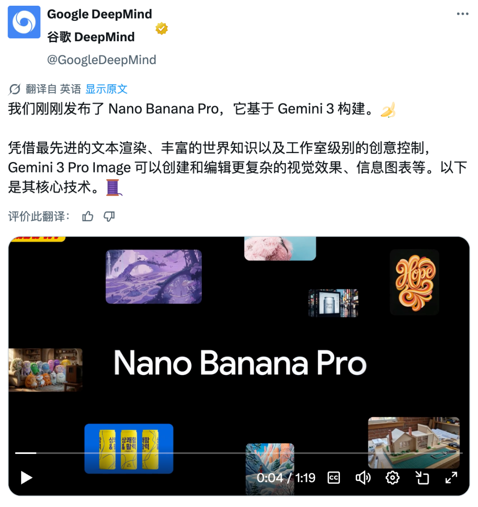

# Awesome Nano Banana Pro Prompts - Most Comprehensive Collection

[](README_EN.md) [](README.md) [](https://github.com/xianyu110/awesome-nanobananapro-prompts) [](https://github.com/xianyu110/awesome-nanobananapro-prompts)

> 🎨 **Want to run these prompts right now?** Open **[GPT Image 2.5 online](https://gptimage2.asia/?utm_source=github&utm_medium=readme&utm_campaign=nanobananapro_en&utm_content=banner)** — one free try, no API key needed, 1K–4K output and reference-image editing. Every case below has a "Try this prompt" link that opens the generator with the prompt pre-filled (results will differ between models).

## Table of Contents

- [Project Overview](#project-overview)
- [Core Features](#core-features)
- [Case Showcase](#case-showcase)
- [Submission Guidelines](#submission-guidelines)
- [Access Channels](#access-channels)
- [More from the Author](#more-from-the-author)
- [Contributors](#contributors)
- [License](#license)

## Project Overview

### Foreword: Google Releases Nano Banana Pro, Ushering in a New Era of AI Image Generation

OpenAI faces its darkest hour.

Google's AI offensive shows no signs of weakening. While Gemini 3 Pro recently targeted the "frontend" domain, today it's the design industry's turn.

The newly released **Nano Banana Pro (Gemini 3 Pro Image)** delivers another powerful punch in image generation capabilities. The jobs of junior designers may be in jeopardy.



---

## Access Platforms

### International Access

- https://aistudio.google.com/apps
- https://gemini.google.com
- 🎨 [GPT Image 2.5 online (gptimage2.asia)](https://gptimage2.asia/?utm_source=github&utm_medium=readme&utm_campaign=nanobananapro_en&utm_content=platforms) — no API key, one free try, 4K output and reference-image editing

### Domestic Access Channels (China)

- https://trygpt.asia/list/#/home

### Proxy API

- https://tryallapi.com/

---

## Core Features

| Feature | Description |
|---------|-------------|
| 🎨 **Resolution Support** | Outputs up to 4K resolution images |
| 🔄 **Multi-round Editing** | Supports conversational, multi-round image editing workflows |
| 🖼️ **Multi-image Composition** | Combines up to 14 input images into 1 output image |
| 🔍 **Search Enhancement** | Integrated Google search capabilities for precise, up-to-date knowledge support |
| 🧠 **Deep Thinking** | Performs physics simulation and logical reasoning before generation, not just imitation |
| 🌍 **Multilingual Support** | Supports generating text in multiple languages, one-click translation and localization |
| 📝 **Ultra-long Context** | 64K input token limit, understands extremely long text prompts |
| 👥 **Character Consistency** | Maintains appearance consistency of up to 5 characters across multiple images |
| 🎮 **Professional Control** | Adjust camera angles, lighting, styles, color grading through text instructions |
| 🔒 **AI Transparency** | All generated content includes SynthID digital watermarks for source verification |

---

## Case Showcase

> 📊 **Featuring 986+ curated cases**
> Visit the [Online Gallery](https://xianyu110.github.io/awesome-nanobananapro-prompts/) or check [gpt4o-image-prompts-master directory](https://github.com/xianyu110/awesome-nanobananapro-prompts/tree/main/gpt4o-image-prompts-master) for more

---

#### 1. Hand-drawn Style Infographic Card

**Category**: 🎨 Featured Case | **Source**: @unknown | **Case ID**: 1

<div style="text-align: center; margin: 20px 0;">

</div>

**Prompt:**
```
Create a hand-drawn style infographic card, 9:16 portrait ratio. The card theme is distinct, with a background of beige or off-white with paper texture, overall design reflecting simple, friendly hand-drawn aesthetics. At the top of the card, use large, bold brush script fonts in contrasting red and black to highlight the title, attracting visual focus. All text content uses Chinese running script, with overall layout divided into 2-4 clear sections, each expressing core points in concise, refined Chinese phrases...
```

👉 [Try this prompt on GPT Image 2.5](https://gptimage2.asia/generate?utm_source=github&utm_medium=readme&utm_campaign=nanobananapro_en&utm_content=case_1)

---

#### 2. Four-panel Comic (Theory of Relativity)

**Category**: 🎨 Featured Case | **Source**: @unknown | **Case ID**: 2

<div style="text-align: center; margin: 20px 0;">

</div>

**Prompt:**
```
make a colorful page of manga describing the theory of relativity. add some humor
```

👉 [Try this prompt on GPT Image 2.5](https://gptimage2.asia/generate?prompt=make%20a%20colorful%20page%20of%20manga%20describing%20the%20theory%20of%20relativity.%20add%20some%20humor&utm_source=github&utm_medium=readme&utm_campaign=nanobananapro_en&utm_content=case_2) (prompt pre-filled)

---

#### 3. Bee Science City

**Category**: 🎨 Featured Case | **Source**: @unknown | **Case ID**: 3

<div style="text-align: center; margin: 20px 0;">

</div>

**Prompt:**
```
Create image in 3D Q-version mini style, a honeycomb-structured sweet research base, with buildings stacked from hexagonal transparent wax chambers, topped with a sunflower shower head dripping honey, exterior walls covered with glowing pollen vines. Side extends honeycomb slides and dandelion parachutes, entrance is a rotating sunflower revolving door...
```

👉 [Try this prompt on GPT Image 2.5](https://gptimage2.asia/generate?utm_source=github&utm_medium=readme&utm_campaign=nanobananapro_en&utm_content=case_3)

---

#### 4. Musk Painting in the Park

**Category**: 🎨 Featured Case | **Source**: @unknown | **Case ID**: 4

<div style="text-align: center; margin: 20px 0;">

</div>

**Prompt:**
```
Create a realistic outdoor scene where a Japanese artist is painting Elon Musk. In the scene, the artist sits at an easel while Musk sits opposite being painted (no cartoon or anime style). The environment should be vibrant, natural, and sunny - such as a park or a busy outdoor location. The overall style must be completely realistic, with one exception: the work on the artist's easel should be a Ghibli-style anime portrait of Musk, creating a strong contrast with the surrounding realistic environment...
```

👉 [Try this prompt on GPT Image 2.5](https://gptimage2.asia/generate?utm_source=github&utm_medium=readme&utm_campaign=nanobananapro_en&utm_content=case_4)

---

#### 5. Create Your Own GTA Character

**Category**: 🎨 Featured Case | **Source**: @Anima_Labs | **Case ID**: 5

<div style="text-align: center; margin: 20px 0;">

</div>

**Prompt:**
```
Act as a creative director at Rockstar Games. Create a fictional GTA VI character sheet in the exact same style as the official GTA VI promotional images.

The layout must be:
A horizontal character sheet, with the character on the right, in a dynamic pose that reflects their personality.
On the left, include the following structured text:
A small "VI" logo at the top left...
```

👉 [Try this prompt on GPT Image 2.5](https://gptimage2.asia/generate?prompt=Act%20as%20a%20creative%20director%20at%20Rockstar%20Games.%20Create%20a%20fictional%20GTA%20VI%20character%20sheet%20in%20the%20exact%20same%20style%20as%20the%20official%20GTA%20VI%20promotional%20images.%0A%0AThe%20layout%20must%20be%3A%0A%0AA%20horizontal%20character%20sheet%2C%20with%20the%20character%20on%20the%20right%2C%20in%20a%20dynamic%20pose%20that%20reflects%20their%20personality.%0AOn%20the%20left%2C%20include%20the%20following%20structured%20text%3A%0AA%20small%20%22VI%22%20logo%20at%20the%20top%20left%20%28mention%20it%20visually%29.%0AThe%20character%E2%80%99s%20name%20in%20big%20bold%20text.%0AA%20catchy%20slogan%20or%20tagline%20right%20below%20in%20a%20different%20bright%20color.%0AA%20short%20backstory%20%283%E2%80%935%20lines%29%20written%20in%20an%20ironic%2C%20street-smart%2C%20or%20playful%20tone%20%E2%80%94%20just%20like%20Rockstar%E2%80%99s%20tone%20of%20voice.%0A%0AUse%20the%20vibrant%20Vice%20City%20aesthetic%20with%20sunset%20lighting%2C%20neon%20accents%2C%20and%20cel-shaded%20comic%20style.%20The%20character%E2%80%99s%20clothing%2C%20action%2C%20and%20environment%20must%20reflect%20their%20archetype%20and%20background.%0A%0ALet%20me%20customize%20the%20following%20variables%3A%0A%0AArchetype%3A%20%7Byour%20choice%7D%0A%0AGender%3A%20%7Byour%20choice%7D%0A%0ASkin%20tone%3A%20%7Byour%20choice%7D%0A%0AHairstyle%3A%20%7Byour%20choice%7D%0A%0AEmotion%20%3A%20%7Byour%20choice%7D%0A%0AOutfit%3A%20%7Byour%20choice%7D%0A%0AWeapon%20or%20action%3A%20%7Byour%20choice%7D%0A%0ABackground%20details%3A%20%7Byour%20choice%7D%0A%0AGenerate%20a%20fictive%20name%20in%20tittle%20and%20a%20description%20in%20english%0A%0AFormat%20the%20final%20result%20like%20a%20finished%20in-game%20asset%20reveal.%20The%20vibe%20should%20be%20over-the-top%2C%20stylish%2C%20and%20full%20of%20personality%20%E2%80%94%20as%20if%20part%20of%20the%20real%20GTA%20VI%20world.%0A%0A%28if%20the%20%22Your%20choice%22%20sections%20are%20not%20filled%20with%20personalized%20information%2C%20it%27s%20up%20to%20you%20to%20generate%20it%20randomly%20by%20yourself%29%20generate%20the%20visual%20directly%20from%20now%20on&utm_source=github&utm_medium=readme&utm_campaign=nanobananapro_en&utm_content=case_5) (prompt pre-filled)

---

#### 6. Golden Abstract Synthesis Style

**Category**: 🎨 Featured Case | **Source**: @firatbilal | **Case ID**: 6

<div style="text-align: center; margin: 20px 0;">

</div>

**Prompt:**
```
{
    "base_image": "uploaded image",
    "style_transfer": {
        "visual_characteristics": {
            "head_and_face": {
                "material": "translucent resin with embedded starlight and glowing neural circuits",
                "surface_effect": "mirror-gloss with gold filament veins and galaxy-like reflections"...
```

👉 [Try this prompt on GPT Image 2.5](https://gptimage2.asia/generate?prompt=%7B%0A%20%20%20%20%22base_image%22%3A%20%22uploaded%20image%22%2C%0A%20%20%20%20%22style_transfer%22%3A%20%7B%0A%20%20%20%20%20%20%20%20%22visual_characteristics%22%3A%20%7B%0A%20%20%20%20%20%20%20%20%20%20%20%20%22head_and_face%22%3A%20%7B%0A%20%20%20%20%20%20%20%20%20%20%20%20%20%20%20%20%22material%22%3A%20%22translucent%20resin%20with%20embedded%20starlight%20and%20glowing%20neural%20circuits%22%2C%0A%20%20%20%20%20%20%20%20%20%20%20%20%20%20%20%20%22surface_effect%22%3A%20%22mirror-gloss%20with%20gold%20filament%20veins%20and%20galaxy-like%20reflections%22%2C%0A%20%20%20%20%20%20%20%20%20%20%20%20%20%20%20%20%22lighting%22%3A%20%22dynamic%20cinematic%20rim%20lights%20with%20volumetric%20glow%22%0A%20%20%20%20%20%20%20%20%20%20%20%20%7D%2C%0A%20%20%20%20%20%20%20%20%20%20%20%20%22body_structure%22%3A%20%7B%0A%20%20%20%20%20%20%20%20%20%20%20%20%20%20%20%20%22texture%22%3A%20%22high-polish%20white%20ceramic%20with%20embedded%20gold%20wiring%22%2C%0A%20%20%20%20%20%20%20%20%20%20%20%20%20%20%20%20%22design%22%3A%20%22futuristic%20like%20organic%20plating%22%2C%0A%20%20%20%20%20%20%20%20%20%20%20%20%20%20%20%20%22highlight_elements%22%3A%20%22subtle%20internal%20light%20flows%20mimicking%20synaptic%20energy%22%0A%20%20%20%20%20%20%20%20%20%20%20%20%7D%2C%0A%20%20%20%20%20%20%20%20%20%20%20%20%22motion_effect%22%3A%20%7B%0A%20%20%20%20%20%20%20%20%20%20%20%20%20%20%20%20%22visual_glitch%22%3A%20%22subtle%20horizontal%20motion%20blur%20on%20head%20edges%22%2C%0A%20%20%20%20%20%20%20%20%20%20%20%20%20%20%20%20%22energy_flow%22%3A%20%22faint%20pulsing%20particle%20lights%20across%20body%22%0A%20%20%20%20%20%20%20%20%20%20%20%20%7D%2C%0A%20%20%20%20%20%20%20%20%20%20%20%20%22background%22%3A%20%7B%0A%20%20%20%20%20%20%20%20%20%20%20%20%20%20%20%20%22type%22%3A%20%22neutral%20gradient%20or%20dark%20void%22%2C%0A%20%20%20%20%20%20%20%20%20%20%20%20%20%20%20%20%22focus%22%3A%20%22emphasize%20figure%27s%20luminous%20contrast%22%0A%20%20%20%20%20%20%20%20%20%20%20%20%7D%0A%20%20%20%20%20%20%20%20%7D%2C%0A%20%20%20%20%20%20%20%20%22application_target%22%3A%20%22Replace%20surface%20and%20material%20style%20of%20uploaded%20image%20with%20the%20characteristics%20described%20above%2C%20while%20preserving%20the%20original%20pose%2C%20structure%2C%20and%20composition%20of%20the%20target%20image.%22%0A%20%20%20%20%7D%0A%7D&utm_source=github&utm_medium=readme&utm_campaign=nanobananapro_en&utm_content=case_6) (prompt pre-filled)

---

#### 7. Embroidered Portrait

**Category**: 🎨 Featured Case | **Source**: @azed_ai | **Case ID**: 7

<div style="text-align: center; margin: 20px 0;">

</div>

**Prompt:**
```
An embroidered portrait of [subject], [colors] thread on deep linen fabric. Visible needlework, layered textures, and handmade patterns give it an earthy, sacred feel.
```

👉 [Try this prompt on GPT Image 2.5](https://gptimage2.asia/generate?prompt=An%20embroidered%20portrait%20of%20%5Bsubject%5D%2C%20%5Bcolors%5D%20thread%20on%20deep%20linen%20fabric.%20Visible%20needlework%2C%20layered%20textures%2C%20and%20handmade%20patterns%20give%20it%20an%20earthy%2C%20sacred%20feel.&utm_source=github&utm_medium=readme&utm_campaign=nanobananapro_en&utm_content=case_7) (prompt pre-filled)

---

#### 8. Embroidery Illustration Style

**Category**: 🎨 Featured Case | **Source**: @Artedeingenio | **Case ID**: 8

<div style="text-align: center; margin: 20px 0;">

</div>

**Prompt:**
```
A handcrafted illustration that simulates traditional embroidery using colorful threads on linen fabric. All elements are “stitched” with visible yarn textures, using techniques like satin stitch, backstitch, and French knots. Raised contours and directional thread flow create a tactile, cozy appearance. The background is made of woven linen, with gentle pastel or folk-inspired colors. The composi...
```

👉 [Try this prompt on GPT Image 2.5](https://gptimage2.asia/generate?prompt=A%20handcrafted%20illustration%20that%20simulates%20traditional%20embroidery%20using%20colorful%20threads%20on%20linen%20fabric.%20All%20elements%20are%20%E2%80%9Cstitched%E2%80%9D%20with%20visible%20yarn%20textures%2C%20using%20techniques%20like%20satin%20stitch%2C%20backstitch%2C%20and%20French%20knots.%20Raised%20contours%20and%20directional%20thread%20flow%20create%20a%20tactile%2C%20cozy%20appearance.%20The%20background%20is%20made%20of%20woven%20linen%2C%20with%20gentle%20pastel%20or%20folk-inspired%20colors.%20The%20composition%20is%20friendly%20and%20magical%2C%20evoking%20a%20storybook%20charm.%20Include%20decorative%20details%20such%20as%20flowers%2C%20suns%2C%20clouds%2C%20trees%20or%20symbols%20to%20enhance%20the%20folk%20embroidery%20style.&utm_source=github&utm_medium=readme&utm_campaign=nanobananapro_en&utm_content=case_8) (prompt pre-filled)

---

#### 9. Iznik Ceramic Style

**Category**: 🎨 Featured Case | **Source**: @firatbilal | **Case ID**: 9

<div style="text-align: center; margin: 20px 0;">

</div>

**Prompt:**
```
Using the uploaded image as the exact visual base, transform it into a hyper-realistic 3D object that retains the original shape and proportions of the logo only. Apply traditional Ottoman Iznik ceramic textures—featuring a warm white glazed base with delicate crackle lines, overlaid with vivid cobalt blue, turquoise, and bold red floral motifs such as tulips, carnations, and arabesque vines. The ...
```

👉 [Try this prompt on GPT Image 2.5](https://gptimage2.asia/generate?prompt=Using%20the%20uploaded%20image%20as%20the%20exact%20visual%20base%2C%20transform%20it%20into%20a%20hyper-realistic%203D%20object%20that%20retains%20the%20original%20shape%20and%20proportions%20of%20the%20logo%20only.%20Apply%20traditional%20Ottoman%20Iznik%20ceramic%20textures%E2%80%94featuring%20a%20warm%20white%20glazed%20base%20with%20delicate%20crackle%20lines%2C%20overlaid%20with%20vivid%20cobalt%20blue%2C%20turquoise%2C%20and%20bold%20red%20floral%20motifs%20such%20as%20tulips%2C%20carnations%2C%20and%20arabesque%20vines.%20The%20entire%20logo%20should%20be%20treated%20as%20a%20standalone%20porcelain%20sculpture%20with%20raised%2C%20hand-painted%20detailing%20and%20no%20background%20plate%20or%20tile%20structure.%20Ensure%20the%20decorative%20patterns%20elegantly%20follow%20the%20contours%20of%20the%20Bugatti%20logo%2C%20without%20altering%20its%20form.%20Render%20the%20object%20in%20a%20pure%20black%20background%20with%20Cinema%204D-style%20product%20lighting%E2%80%94highlighting%20realistic%20ceramic%20gloss%2C%20material%20depth%2C%20and%20subtle%20reflections.%20The%20final%20result%20should%20feel%20like%20a%20luxurious%20handcrafted%20ceramic%20reinterpretation%2C%20balancing%20heritage%20ornamentation%20with%20industrial%20branding.&utm_source=github&utm_medium=readme&utm_campaign=nanobananapro_en&utm_content=case_9) (prompt pre-filled)

---

#### 10. Melting Mutant Text

**Category**: 🎨 Featured Case | **Source**: @gnrlyxyz | **Case ID**: 10

<div style="text-align: center; margin: 20px 0;">

</div>

**Prompt:**
```
Create a psychedelic, grotesque cartoon-style text design that says “GNARLY”. Arrange the letters in a straight horizontal line. Each letter should be lumpy, melting, and oozing with bright, clashing flat colors like slime green, neon yellow, and hot pink. Each letter must be filled with only one solid flat color, with no gradients or transitions. All drips, melts, and oozes must be solid black wi...
```

👉 [Try this prompt on GPT Image 2.5](https://gptimage2.asia/generate?prompt=Create%20a%20psychedelic%2C%20grotesque%20cartoon-style%20text%20design%20that%20says%20%E2%80%9CGNARLY%E2%80%9D.%20Arrange%20the%20letters%20in%20a%20straight%20horizontal%20line.%20Each%20letter%20should%20be%20lumpy%2C%20melting%2C%20and%20oozing%20with%20bright%2C%20clashing%20flat%20colors%20like%20slime%20green%2C%20neon%20yellow%2C%20and%20hot%20pink.%20Each%20letter%20must%20be%20filled%20with%20only%20one%20solid%20flat%20color%2C%20with%20no%20gradients%20or%20transitions.%20All%20drips%2C%20melts%2C%20and%20oozes%20must%20be%20solid%20black%20with%20no%20shading%20or%20gradient.%20Make%20the%20design%20vector-friendly%20with%20clean%2C%20solid%20fills%20and%20bold%20black%20outlines.%20Add%20extra%20black%20and%20white%20eyeballs%20to%20make%20each%20letter%20feel%20like%20a%20weird%20mutated%20creature.%20Keep%20the%20composition%20chaotic%20but%20readable%2C%20like%20a%20mutant%20version%20of%20a%20Saturday%20morning%20cartoon.%20Black%20background.%20Square%20aspect%20ratio.&utm_source=github&utm_medium=readme&utm_campaign=nanobananapro_en&utm_content=case_10) (prompt pre-filled)

---

> 📌 **View More Cases**
> Visit the [Online Gallery](https://xianyu110.github.io/awesome-nanobananapro-prompts/) to browse all 986+ cases
> Or check [gpt4o-image-prompts-master](https://github.com/xianyu110/awesome-nanobananapro-prompts/tree/main/gpt4o-image-prompts-master) for complete data and prompts  
> Want an image right away? Paste any prompt into [GPT Image 2.5 online](https://gptimage2.asia/?utm_source=github&utm_medium=readme&utm_campaign=nanobananapro_en&utm_content=more_cases) (one free try, no API key)

## Submission Guidelines

We welcome contributions of more high-quality prompt examples to this project!

### Submission Requirements

- Complete Content: Include prompts and result images
- Clear Categories: Label case categories (e.g., Character Consistency, Translation & Coloring, Poster Design, etc.)
- Quality First: Prioritize outstanding and representative examples
- Standard Format: Submit according to existing format

### Submission Methods

1. **GitHub Submission**: Submit Pull Request directly to this project
2. **Issue Submission**: Submit new cases in [GitHub Issues](https://github.com/xianyu110/awesome-nanobananapro-prompts/issues)

### Submission Template

```markdown
**Case Title**: Brief description of the case content

**Category**: [Character Consistency/Translation & Coloring/Poster Design/Game Design/UI Design/Product Rendering/IP Creation/Traditional Art/Infographics/Style Transfer/Scene Editing/Visual Design]

**Prompt**: Detailed prompt content

**Result Images**: Result image links or attachments

**Notes**: (Optional) Special notes or technique sharing for the case
```

## Access Channels

### Online Generators & Domestic Channels

| Platform | Description | Link |
|----------|-------------|------|
| 🎨 gptimage2.asia | GPT Image 2.5 online: no API key, one free try, 1K–4K output, reference-image editing | [Visit](https://gptimage2.asia/?utm_source=github&utm_medium=readme&utm_campaign=nanobananapro_en&utm_content=channels) |
| 🎯 trygpt.asia | Stable reliable domestic mirror | [Visit](https://trygpt.asia/list/#/home) |

### Proxy API

- [tryallapi.com](https://tryallapi.com/) - Paid API service

### Official Platforms

- [Google AI Studio](https://aistudio.google.com/apps) - Official development platform
- Gemini App / Web - Official application

## More from the Author

**Online tools**

| Site | What it does |
|------|--------------|
| 🎨 [GPT Image 2.5 · gptimage2.asia](https://gptimage2.asia/?utm_source=github&utm_medium=readme&utm_campaign=nanobananapro_en&utm_content=more_from_author) | Text-to-image and reference-image editing, no API key, one free try |
| 🎬 [Seedream · tryseedream.asia](https://tryseedream.asia/en?utm_source=github&utm_medium=readme&utm_campaign=nanobananapro_en&utm_content=more_from_author) | AI image + video generator (Seedream), Google sign-in |
| ✍️ [Inkdoo · inkdoo.app](https://inkdoo.app/?utm_source=github&utm_medium=readme&utm_campaign=nanobananapro_en&utm_content=more_from_author) | AI article illustrations with a consistent character |
| 🎞️ [MiniMax prompts · tryminimax.asia](https://tryminimax.asia/en?utm_source=github&utm_medium=readme&utm_campaign=nanobananapro_en&utm_content=more_from_author) | Curated MiniMax video prompts with examples |
| 🎃 [HallowPaws · hallowpaws.com](https://hallowpaws.com/?utm_source=github&utm_medium=readme&utm_campaign=nanobananapro_en&utm_content=more_from_author) | Halloween AI photos of your pet |

**Other open-source collections**

- [awesome-gpt-image2.5](https://github.com/xianyu110/awesome-gpt-image2.5) - GPT Image 2.5 (Flare / Sunburst) gallery with copyable prompts
- [awesome-gptimage2](https://github.com/xianyu110/awesome-gptimage2) - GPT Image 2 prompt handbook
- [awesome-nano-banana](https://github.com/xianyu110/awesome-nano-banana) - Gemini image generation case collection [Visit Online](https://xianyu110.github.io/awesome-nano-banana/)
- [awesome-minimax-h3-prompts](https://github.com/xianyu110/awesome-minimax-h3-prompts) - Curated MiniMax H3 video prompts
- [awesome-claude-opus-5.5](https://github.com/xianyu110/awesome-claude-opus-5.5) - Claude Opus 5.5 real-world showcase
- [awesome-fable-5.5](https://github.com/xianyu110/awesome-fable-5.5) - Claude Fable 5.5 showcase and tests
- [awesome-openclaw-tutorial](https://github.com/xianyu110/awesome-openclaw-tutorial) - OpenClaw tutorial (4,500+ stars)
- [awesome-claudcode-tutorial](https://github.com/xianyu110/awesome-claudcode-tutorial) - Claude Code tutorial

## Contributors

Thanks to all friends who have contributed cases and prompts to this project!

- Welcome to submit Pull Requests to contribute more high-quality cases
- Submit Issues to report problems or suggestions
- Share this project to let more people know about the powerful capabilities of Nano Banana Pro

## License

This project is licensed under the [MIT License](LICENSE).

---

<div align="center">

**⭐ If this project helps you, please give it a Star to support us!**

Made with ❤️ by the Nano Banana Pro Community

</div>
